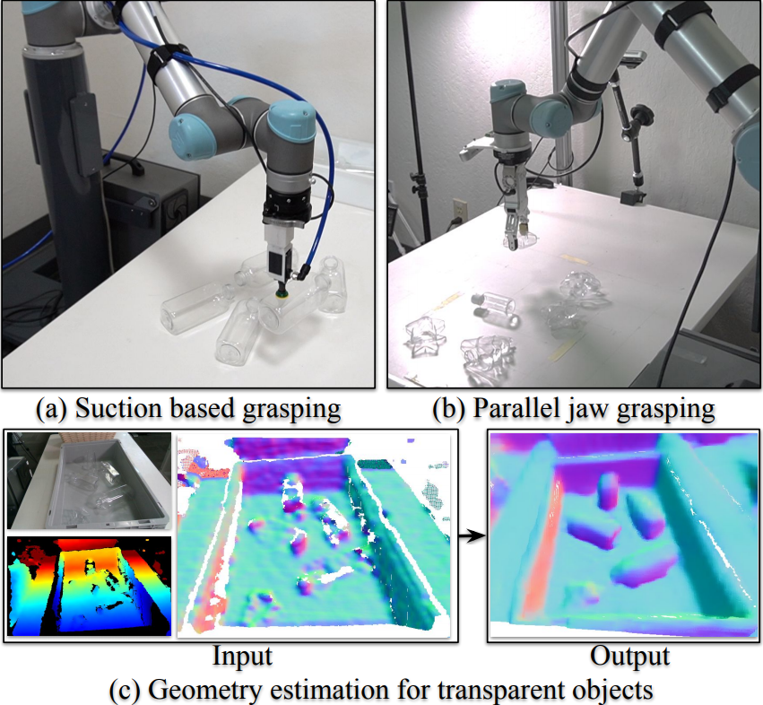
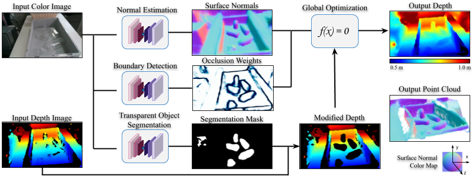
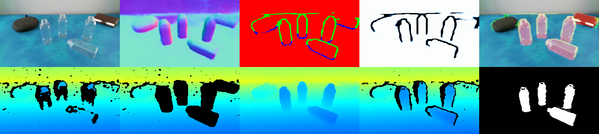

# ClearGrasp: 3D Shape Estimation of Transparent Objects for Manipulation

Welcome to the official repository for the ClearGrasp paper. ClearGrasp leverages deep learning with synthetic training data to infer accurate 3D geometry of transparent objects from a single RGB-D image. The estimated geometry can be directly used for downstream robotic manipulation tasks (e.g. suction and parallel-jaw grasping).

This repository provides:
- An API for our depth estimation pipeline
- PyTorch code for training and testing our models
- Demo code to see ClearGrasp in action with a RealSense D400 series camera
- Real images dataset capture utility




Resources : <b> [PDF](https://arxiv.org/abs/1910.02550) | [Website - Video, Dataset & Results](https://sites.google.com/view/cleargrasp) </b>

Authors: [Shreeyak S Sajjan](https://www.linkedin.com/in/shreeyak-sajjan/), [Matthew Moore](https://www.linkedin.com/in/matthewpaulmoore/), [Mike Pan](https://www.linkedin.com/in/panmike/), [Ganesh Nagaraja](https://www.linkedin.com/in/ganesh-nagaraja/), [Johnny Lee](http://johnnylee.net/), [Andy Zeng](http://andyzeng.github.io/), [Shuran Song](https://shurans.github.io/index.html)

Publication: <i> International Conference on Robotics and Automation (ICRA), 2020 </i>

[Download Data - Training Set](https://storage.googleapis.com/cleargrasp/cleargrasp-dataset-train.tar)  
[Download Data - Testing and Validation Set](https://storage.googleapis.com/cleargrasp/cleargrasp-dataset-test-val.tar)  
[Download Model checkpoints](https://storage.googleapis.com/cleargrasp/cleargrasp-checkpoints.zip)  
[Download 3D Models](https://storage.googleapis.com/cleargrasp/cleargrasp-3d-models.tar)

</br></br></br></br></br></br></br></br>

Transparent objects possess unique visual properties that make them incredibly difficult for standard 3D sensors to produce accurate depth estimates for. In many cases, they often appear as
noisy or distorted approximations of the surfaces that lie behind them. To address these challenges, we present ClearGrasp – a
deep learning approach for estimating accurate 3D geometry of transparent objects for robotic manipulation.
The experiments demonstrate that ClearGrasp is substantially better than monocular depth estimation baselines and is capable of generalizing to real-world images and novel objects. We also demonstrate that ClearGrasp can be applied out-of-the-box to improve grasping algorithms’ performance on transparent objects.  
Given a single RGB-D image of transparent objects, ClearGrasp first uses the color image as input to deep convolutional networks to infer a set of information: surface normals, occlusion boundaries. The mask is used to "clean" the input depth by removing all points corresponding to transparent surfaces. ClearGrasp then uses a global optimization algorithm which uses surface normals and occlusion boundaries to reconstruct the depth of the transparent objects.


<p align="center"> 
      
</p>
<p align="center"> 
    <i>Method Overview</i>  
</p>


### Contact:

If you have any questions or find any bugs, please file a github issue or contact me:  
Shreeyak Sajjan: shreeyak[dot]sajjan[at]gmail[dot]com

### Updates:

- Updated broken links to data
- Added temporary scripts that were used in handling data and creating visualizations. Reference only, might not run.

## Installation

This code is tested with Ubuntu 16.04, Python3.6 and [Pytorch](https://pytorch.org/get-started/locally/) 1.3, and CUDA 9.0.  

### System Dependencies

```bash
sudo apt-get install libhdf5-10 libhdf5-serial-dev libhdf5-dev libhdf5-cpp-11
sudo apt install libopenexr-dev zlib1g-dev openexr
sudo apt install xorg-dev  # display widows
sudo apt install libglfw3-dev
```

### LibRealSense (Optional)

If you want to run demos with an Intel RealSense camera, you may need to install [LibRealSense](https://github.com/IntelRealSense/librealsense). It is required to stream and capture images from Intel Realsense D415/D435 stereo cameras.  
Please check the [installation guide](https://github.com/IntelRealSense/librealsense/blob/master/doc/distribution_linux.md) to install from binaries, or compile from source.

```bash
# Register the server's public key:
$ sudo apt-key adv --keyserver keys.gnupg.net --recv-key C8B3A55A6F3EFCDE || sudo apt-key adv --keyserver hkp://keyserver.ubuntu.com:80 --recv-key C8B3A55A6F3EFCDE

# Ubuntu 16 LTS - Add the server to the list of repositories
$ sudo add-apt-repository "deb http://realsense-hw-public.s3.amazonaws.com/Debian/apt-repo xenial main" -u

# Install the libraries
$ sudo apt-get install librealsense2-dkms
$ sudo apt-get install librealsense2-utils

# Install the developer and debug packages
$ sudo apt-get install librealsense2-dev
$ sudo apt-get install librealsense2-dbg
```


## Setup

1. Clone the repository. A small sample dataset of 3 real and 3 synthetic images is included.

    ```bash
    git clone git@github.com:Shreeyak/cleargrasp.git
    ```

2. Install pip dependencies by running in terminal:

   ```bash
   pip install -r requirements.txt
   ```
   
3. Download the data:  
   a) [Model Checkpoints](https://storage.googleapis.com/cleargrasp/cleargrasp-checkpoints.zip) (0.9GB) - Trained checkpoints of our 3 deeplabv3+ models.  
   b) [Train dataset](https://storage.googleapis.com/cleargrasp/cleargrasp-dataset-train.tar) (Optional, 72GB) - Contains the synthetic images used for training the models. No real images were used for training.  
   c) [Val + Test datasets](https://storage.googleapis.com/cleargrasp/cleargrasp-dataset-test-val.tar) (Optional, 1.7GB) - Contains the real and synthetic images used for validation and testing.  

   Extract these into the `data/` directory or create symlinks to the extracted directories in `data/`.

4. Compile depth2depth (global optimization):

    `depth2depth` is a C++ global optimization module used for depth completion, adapted from the [DeepCompletion](http://deepcompletion.cs.princeton.edu/) project. It resides in the `api/depth2depth/` directory.

    - To compile the depth2depth binary, you will first need to identify the path to libhdf5. Run the following command in terminal:
    
        ```bash
        find /usr -iname "*hdf5.h*"
        ```
        
        Note the location of `hdf5/serial`. It will look similar to: `/usr/include/hdf5/serial/hdf5.h`.

    - Edit BOTH lines 28-29 of the makefile at `api/depth2depth/gaps/apps/depth2depth/Makefile` to add the path you just found as shown below:

        ```bash
        USER_LIBS=-L/usr/include/hdf5/serial/ -lhdf5_serial
        USER_CFLAGS=-DRN_USE_CSPARSE "/usr/include/hdf5/serial/"
        ```

    - Compile the binary:

        ```bash
        cd api/depth2depth/gaps
        export CPATH="/usr/include/hdf5/serial/"  # Ensure this path is same as read from output of `find /usr -iname "*hdf5.h*"`
        
        make
        ```

        This should create an executable, `api/depth2depth/gaps/bin/x86_64/depth2depth`. The config files will need the path to this executable to run our depth estimation pipeline.

    - Check the executable, by passing in the provided sample files:
    
        ```bash
        cd api/depth2depth/gaps
        bash depth2depth.sh
        ```

        This will generate `gaps/sample_files/output-depth.png`, which should match the `expected-output-depth.png` sample file. It will also generate RGB visualizations of all the intermediate files.


## To run the code:

### 1. ClearGrasp Quick Demo - Evaluation of Depth Completion of Transparent Objects
We provide a script to run our full pipeline on a dataset and calculate accuracy metrics (RMSE, MAE, etc). Resides in the directory `eval_depth_completion/`.  

- Install dependencies and follow [Setup](#setup) to download our model checkpoints and compile `depth2depth`.
- Create a local copy of the config file:
    
    ```bash
    cd eval_depth_completion/
    cp config/config.yaml.sample config/config.yaml
    ```

- Edit the `config/config.yaml` file to set `pathWeightsFile` parameters to the paths of the respective model checkpoints. To run evaluation on the different datasets, set the path(s) to their director(ies) within the `files` parameter.
- Run ClearGrasp on the sample dataset:
    
    ```bash
    python eval_depth_completion.py -c config/config.yaml
    ```
    
    The script will run ClearGrasp on the given dataset, storing all it's output and calculating accuracy metrics of the depth completion of transparent objects.
     The metrics (RMSE, etc.) are stored in a csv file in the results dir. Resized inputs, output depths, output pointclouds and other intermediate files are also saved. 
    
    <p align="center"> 
          
    </p>
    <p align="center"> 
        <i>Example Result. In order: Input RGB image, predicted surface normals, predicted  boundaries, occlusion boundary weights, overlay of masks+boundaries, input depth, cleaned input depth, output depth, ground truth depth, mask of valid transparent pixels (over which metrics are calculated).</i>  
    </p>

    


### 2. Live Demo

We provide a demonstration of how to use our API on images streaming from realsense D400 series camera. Each new frame coming from the camera stream is passed through the depth completion module to obtain completed depth of transparent objects and the results are displayed in a window.  
Resides in the folder `live-demo/`. This demo requires the Librealsense SDK to be installed.

1. Create a copy of the sample config file:

    ```bash
    cd live_demo
    cp config/config.yaml.sample config/config.yaml
    ```

2. Edit `config.yaml` with paths to checkpoints of networks and
depth2depth executable. Edit parameters as per your camera.

3. Compile `realsense.cpp`:

    ```bash
    cd live-demo/realsense/
    mkdir build
    cd build
    cmake ..
    make
    ```

    This will create a binary `build/realsense` which is used to stream images from the realsense camera over TCP/IP. In case of issues, check FAQ.

4. Connect a realsense d400 series camera to USB and start the camera stream:

    ```bash
    cd live_demo/realsense
    ./build/realsense
    ```

    This application will capture RGB and Depth images from the realsense and stream them on an TCP/IP port. It will also open a window with the RGB and Depth images displayed.

5. Run demo:

    ```bash
    python live_demo.py -c config/config.yaml
    ```

    This will open a new window displaying input image, input depth, intermediate outputs (surface normals, occlusion boundaries, mask), modified input depth and output depth. Expect around 1 FPS with an i7 7700K CPU and 1080ti GPU. The global optimization module is CPU bound and takes almost 1 sec per image at 256x144p resolution with CPU at 4.2GHz.

### 3. Training Code

The folder `pytorch_networks/` contains the code used to train the
surface normals, occlusion boundary and semantic segmentation models.

- Go the to respective folder (eg: `pytorch_networks/surface_normals`) and create a local copy of the config file:
    ```bash
    cp config/config.yaml.sample config/config.yaml
    ```

- Edit the `config.yaml` file to fill in the paths to the dataset, select hyperparameter values, etc. All the parameters are explained in comments within the config file.
- Start training: 
    ```bash
    python train.py -c config/config.yaml
    ```
- Eval script can be run by: 
    ```bash
    python eval.py -c config/config.yaml
    ```

### 4. Dataset Capture GUI
Contains GUI application that was used to collect dataset of real transparent objects. First the transparent objects were placed in the scene along with various random opaque objects like cardboard boxes, decorative mantelpieces and fruits. After capturing
and freezing that frame, each object was replaced with an identical spray-painted instance. Subsequent frames would be overlaid on the frozen frame so that the overlap between the
spray painted objects and the transparent objects they were replacing could be observed. With high resolution images, sub-millimeter accuracy can be achieved in the positioning
of the objects.

Run the `dataset_capture_gui/capture_image.py` script to launch a window that streams images directly from a Realsense D400 series camera. Press 'c' to capture the transparent frame, 'v' to capture the opaque frame and spacebar to confirm and save the RGB and Depth images for both frames.


## FAQ

### Data Preprocessing (outlines creation)

The script used for preprocessing data can be found at `z-ignore-scripts-helper/data_processing_script.py`. The script
will not run due to missing files (these were intermediate files generated at render time, such as unrectified depth). 
However, the script can be used as reference for creation of the outlines.

### Details on depth2depth

The `depth2depth` executable expects the following parameters:

- **input_depth.png**: The path for the raw depth map from sensor, which is the depth to refine. It should be saved as 4000 x depth in meter in a 16bit PNG.
- **output_depth.png**: The path for the result, which is the completed depth. It is also saved as 4000 x depth in meter in a 16bit PNG.
- **Occlusion Weights**: The depth discontinuities channel is extracted from the occlusion outlines models' outputs scaled and saved as png file.
- **Surface Normals**: The output of surface normals model is saved as an .h5 file
- **xres, yres**: The resolution of image in x and y axes.
- **fx, fy**: The focal length used to take image in pixels
- **cx, cy**: The centre of the image. Ideally it is equal to (height/2, width/2)
- **inertia weight**: The strength of the penalty on the difference between the input and the output depth map on observed pixels. Set this value higher if you want to maintain the observed depth from input_depth.png.
- **smoothness_weight**: The strength of the penalty on the difference between the depths of neighboring pixels. Higher smoothness weight will produce soap-film-like result.
- **tangent_weight**: The universal strength of the surface normal constraint. Higher tangent weight will force the output to have the same surface normal with the given one.

### Calculation of focal len in pixels (fx, fy)
The focal len in pixels is calculated from the Field of View and Sensor Size of camera, as derived from [here](https://photo.stackexchange.com/questions/97213/finding-focal-length-from-image-size-and-fov):

```bash
F = A / tan(a)
  Where,
    F = Focal len in pixels
    A = image_size/2
    a = FOV/2

=> (focal len in pixels) = ((image width or height)/2 ) / tan( FOV/2 )
```

Here are the calculation for our synthetic images, with angles in degrees for image output at 288x512p:

```bash
Fx = (512 / 2) / tan( 69.40 / 2 ) = 369.71 = 370 pixels
Fy = (288 / 2) / tan( 42.56 / 2 ) = 369.72 = 370 pixels
```

### Notes on data:
1. The 4x4 transformation matrix for each object in the scene can give incorrect rotations since it is not normalized. Use the provided quaternion to get the rotation of each object.
2. Some objects are present in the scene, but not visible to the camera. Your code will have to account for such objects when parsing through the data, using the provided masks.

### ERROR: No module named open3d
In case of Open3D not being recognized, try installing with:

```bash
pip uninstall open3d-python
pip uninstall open3d
pip install open3d --no-cache-dir
```


### FIX for librealsense version V2.15 and earlier

Change the below line:

```c
// Find and colorize the depth data
rs2::frame depth_colorized = color_map.colorize(aligned_depth);
```

to

```c
// Find and colorize the depth data
rs2::frame depth_colorized = color_map(aligned_depth);
```

### ERROR: depth2depth.cpp:11:18: fatal error: hdf5.h: No such file or directory

Make sure HDF5 is installed.
Ensure you edited both lines in the makefile to add path to hdf5, as per directions in Installation section.  
Make sure you exported CPATH before compiling `depth2depth`, as mentioned above (`export CPATH="/usr/include/hdf5/serial/"`).

### ERROR: /usr/bin/ld: cannot find -lrealsense2

You may face this error when compiling realsense.cpp. This may occur when using later versions of librealsense (>=2.24, circa Jun 2019).  
This error can be resolved by compiling Librealsense from source. Please follow the [official instructions](https://github.com/IntelRealSense/librealsense/blob/master/doc/installation.md).

### HOW to change the image resolution streaming from realsense camera?

You can change the image resolution by changing the corresponding lines in the `live_demo/realsense/realsense.cpp` file and re-compiling realsense:

```shell
int stream_width = 640;
int stream_height = 360;
int depth_disparity_shift = 25;
int stream_fps = 30;
```

Also change the following lines in the `live_demo/realsense/camera.py` file to match the cpp file:

```shell
self.im_height = 360
self.im_width = 640
self.tcp_host_ip = '127.0.0.1'
self.tcp_port = 50010
```
